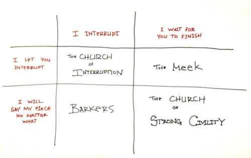

# The Church of Interruption

Sometimes I am startled to realize, in the middle of a discussion, that I have offended or hurt some of the people I’m talking with.

First, know and accept this: I have a friend who is a wizard. He is an ancient and wise wizard, and we have tea together. One teatime, I mentioned my talking troubles to my friend, and he said this:

"Yes, Sam, I’ll bet it is hard for you – holding controversial   
religious beliefs, I mean."

Now, I am not a religious person; and my friend is aware of that.   
Not knowing where he was headed, I nodded for him to continue.  

"You’re a member of the Church of Interruption, you see."

I didn’t see, so again I nodded him on.

"I’m talking about how you behave when we’re talking. When you understand whatever it is I’m trying to say, you don’t wait around for me to finish my sentence, you–"

"Interrupt. Sure. It’s the easiest way to make sure I understand what you mean."

"That’s very insightful. You’re right; if you finish my statement in a way I agree with, I know that you understand. And, if I accept your summary, we both know you’ve got it. It’s very efficient."

I waited, but he said no more. In frustration, I asked, "So what’s   
the problem? And what’s it got to do with religion? You know I’m   
not–"

"Yes, yes, I know. The problem occurs when you imagine that everyone works the same way. If I hadn’t interrupted you just now, how long would you have kept talking about things we both know? If I don’t interrupt to show you I understand – if I don’t signal my understanding in the same way you do – you’ll just keep talking, imagining I don’t get it."

I frowned, but said nothing.

"Let me draw you a diagram." And he did, on a napkin. I’ll reproduce it for you here:

"There are two conversational dogmas. They’re self-consistent, you can subscribe to either one, and if you do, you will be able to happily converse with anyone else in your church. They are the Church of Interruption –"

"That’s mine, isn’t it? It doesn’t sound complimentary."

"It is yours, but it’s just a name. Your creedo goes something like:"  

> #### THE HOLY CREEDO OF THE CHURCH OF INTERRUPTION:
>
> 1. Thou shalt interrupt when thou understand’st.
> 2. Thou shalt speak until I interrupt.
> 3. Thou shalt use physical cues to indicate when I ought continue talking.

"There’s nothing wrong with the COI. I’ll admit, though, that the   
Church of Strong Civility has a better name. Their doctrine–"

"Let me see if I can guess. One: Thou shalt not interrupt." I felt   
was catching on.

He nodded. "And?"

"Uh. There’s more?"

> #### DOCTRINES OF THE CHURCH OF STRONG CIVILITY
>
> 1. Thou shalt not interrupt.
> 2. Thou shalt speak briefly.
> 3. Thou shalt use physical cues to indicate your understanding and desire to speak.

"Now," he said, when I had both of these in front of me, "what   
happens–"

"–when a member of the COI talks to a Strong Civilist? Oh, no," and I turned red, because I was imagining all of the conversations I had completely muffed. Everything was backward! "All the evidence I read as ‘Keep talking’ might really be saying ‘SHUT UP ALREADY!’"

He nodded.

I thought for a moment. "Okay. That makes sense. There must be signs, right? I can learn to recognize them, and then–"

"And then what? Conversational habits you’ve been building for decades won’t work anymore. It’s a harder problem than you think; there’s not much neutral ground for ecumenical relations, and it isn’t easy to learn to be a turncoat."

"And what about the other two boxes – the ones that sound like strange semi-human races in a Wellsian future?"

"I doubt you know much about The Meek," he said. "They get along alright with the Civilists, but if they meet the COI, they shut up tight, like mussels. If you want to learn anything from them, they must never be interrupted. Silence is the only knife thin enough to wedge into the shell of The Meek."

Here he paused, and I tried to hold my tongue, solemnly. I lasted   
a few seconds before breaking – I was too interested in what would   
come next. "And Barkers?"

"Barkers are delightful storytellers, brilliant lecturers, and apalling conversationalists. You cannot meet a Barker on his own territory – not if you wish to tell him anything. Conversing with a Barker is an advanced technique. The first task for you will not be talking to a Barker, but ensuring that you never become one."

"That can happen?"

"Of course! In the blink of an eye. As soon as you decide that   
someone has nothing of interest to say, you become a Barker in   
their eyes. If that happens too often, it becomes a habit – and you   
might never talk with another human again."

He fixed me with a hard, bright eye. I shivered. Kindly, he changed   
the subject.

I reproduce our conversation here because I found it very enlightening, but understand this: while I now understand why people look hurt or offended, that understanding hasn’t really made it much easier to prevent. Not yet. Habits don’t die easily, and it’s hard to keep friends who aren’t members of my Church. I wonder, though – is the wizard also of the Church of Interruption? Or has he mastered both dogmas? Can he really talk to a Barker?

