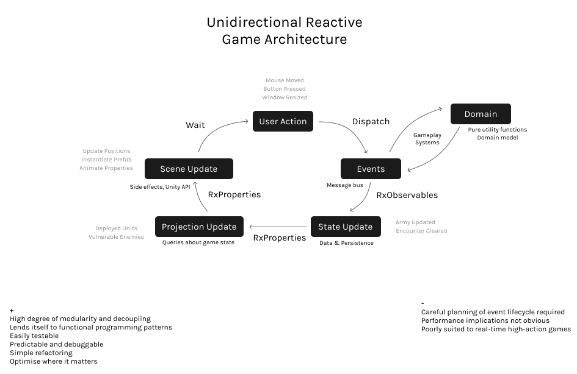

# Software Architecture

* Event-Driven communication
  * Limit direct interaction between components of a system
* Data-Oriented
  * Events -&gt; Components -&gt; Data Updates
  * Data Updates -&gt; Components -&gt; Events
  * Requests -&gt; Components -&gt; Data Queries -&gt; Response
* Unidirectional, immutable, pure, side-effects at boundaries
  * [Functional core, imperative shell](https://app.gitbook.com/@bfollington/s/notes/~/drafts/-M1wtdl3z8PnDUBSFQlc/programming/functional-programming/functional-core-imperative-shell)
* Domain-Driven-Design
  * Carefully architect code around core business concepts

When considering game architecture specifically a few extra elements become relevant:

* Zero-allocation event dispatch
  * Object pooling
* Minimal-allocation state update
  * Clever immutable data structures
* Minimal-allocation projection update
  * Infrequent projection changes can allocate
  * Frequent projection changes should be computed with no allocation
* Minimal-runtime-instantiation of game entities
  * Object pooling
* Object lifecycle handling, no dangling subscriptions

## Data-Oriented Architecture



[https://engineering.fb.com/data-infrastructure/messenger/](https://engineering.fb.com/data-infrastructure/messenger/)

## Unidirectional Dataflow







## Event-Driven \(& Event-Sourcing, CQRS\)

















